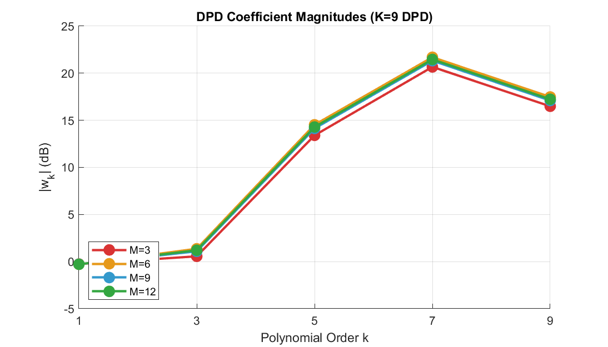

# DPD Polynomial Order vs Sampling Rate — 完整分析報告

**日期**: 2026-04-06
**Script**: `DPD_sampling_analysis.m`
**延伸自**: `PA_poly_regrowth.m` (per-order spectral regrowth)

---

## 1. 研究問題

DPD 使用 odd-order polynomial basis：

```math
z = \sum_{k \in \{1,3,5,7,9\}} w_k \cdot x \cdot |x|^{k-1}
```

第 $k$ 階 basis 的 bandwidth 嚴格等於 $k \cdot \text{BW}$（hard cutoff，見 `PA_poly_regrowth_report.md` 第 3 節推導）。

**核心問題**：如果 DPD sampling rate $F_s = M \cdot \text{BW}$，高 order 的 basis 頻寬超過 Nyquist ($k \cdot \text{BW} > F_s$)，會不會導致 aliasing distortion？對 DPD linearization 的影響有多大？

---

## 2. 模型設定

### 2.1 Input Signal

- 頻寬 $\text{BW} = 20$ MHz，complex baseband
- 產生方式：random-phase IFFT of rectangular mask（同 `PA_poly_regrowth.m`）
- Peak-normalized to 1，PAPR $\approx 8.97$ dB
- Reference rate $F_{s,\text{ref}} = 720$ MHz (36X)，$N_{\text{ref}} = 98304$
- 對每個 target $F_s$，由 $F_{s,\text{ref}}$ 做 integer decimation → **所有 $F_s$ 共用同一波形**

### 2.2 PA Model

Memoryless polynomial（7 階）：

```math
y = x \cdot \bigl(a_1 + a_3|x|^2 + a_5|x|^4 + a_7|x|^6\bigr)
```

| 係數 | 值 | 說明 |
|---|---|---|
| $a_1$ | 1.0 | 小信號增益 |
| $a_3$ | $-0.3 + 0.1j$ | 3 階 IMD + AM/PM |
| $a_5$ | $0.08 - 0.05j$ | 5 階 |
| $a_7$ | $-0.02 + 0.01j$ | 7 階（弱） |

在 $|x| = 0.9$ 約 2 dB AM/AM compression + 3 deg AM/PM。

### 2.3 分析參數

| 參數 | 值 |
|---|---|
| DPD orders $K$ | 1, 3, 5, 7, 9 |
| Oversampling $M$ | 3, 6, 9, 12 |
| $F_s$ | 60, 120, 180, 240 MHz |
| DPD 訓練 | Iterative multiplicative correction, 20 iterations |
| Regularization | Tikhonov $\lambda = 10^{-6}$ |

---

## 3. 分析方法

### 3.1 Golden Reference

以 $F_{s,\text{ref}} = 720$ MHz 計算所有 basis function 和 PA output。對 $K \leq 9$，basis bandwidth 最大 $9 \times 20 = 180$ MHz $\ll$ Nyquist $= 360$ MHz，所以 reference 完全無 aliasing。

### 3.2 比較方法

對每個 target $F_s = M \cdot \text{BW}$：

1. Decimate signal: $x_{\text{lo}} = x_{\text{ref}}[1 : D : \text{end}]$（$D = F_{s,\text{ref}} / F_s$）
2. 在 $F_s$ 計算 basis function: $y_k = x_{\text{lo}} \cdot |x_{\text{lo}}|^{k-1}$
3. Upsample 回 $F_{s,\text{ref}}$（`interpft`，ideal bandlimited interpolation）
4. 和 golden 比較：$\text{NMSE} = 10 \log_{10} \frac{\|y_{k,\text{up}} - y_{k,\text{ref}}\|^2}{\|y_{k,\text{ref}}\|^2}$

---

## 4. Basis Function Aliasing 結果

### 4.1 Total NMSE（全頻段 waveform error）

| | M=3 | M=6 | M=9 | M=12 |
|---|---|---|---|---|
| K=1 | 0 | 0 | 0 | 0 |
| K=3 | 0 (Edge) | 0 | 0 | 0 |
| **K=5** | **-24.2 dB** | 0 | 0 | 0 |
| **K=7** | **-17.8 dB** | **-66.6 dB** | 0 | 0 |
| **K=9** | **-14.3 dB** | **-50.6 dB** | 0 (Edge) | 0 |

### 4.2 In-Band NMSE（僅 $|f| \leq \text{BW}/2$）

| | M=3 | M=6 | M=9 | M=12 |
|---|---|---|---|---|
| K=1 ~ K=5 | 0 | 0 | 0 | 0 |
| **K=7** | **-45.4 dB** | 0 | 0 | 0 |
| **K=9** | **-36.4 dB** | 0 | 0 | 0 |

**關鍵發現**：K=5 at M=3 雖然有 total aliasing（-24.2 dB），但 **in-band 完全沒有被污染**！

### 4.3 Aliasing 兩層條件

**條件 1** — Total aliasing（$K > M$）：basis bandwidth $K \cdot \text{BW}$ 超過 $F_s$，超出 Nyquist 的頻譜折回。

**條件 2** — In-band aliasing（$K \geq 2M$）：折回的頻率必須落在 signal band 內。推導：

頻率 $f_0$（$F_s/2 < f_0 < K \cdot \text{BW}/2$）折回到 $f_0 - F_s$。要落在 $|f_0 - F_s| \leq \text{BW}/2$：

```math
F_s - \frac{\text{BW}}{2} < f_0 < F_s + \frac{\text{BW}}{2}
```

因為 $f_0 \leq K \cdot \text{BW}/2$，所以需要 $K \cdot \text{BW}/2 > F_s - \text{BW}/2$，即 $K > 2M - 1$，即 **$K \geq 2M$**。

更精確的條件表：

| | M=3 | M=6 | M=9 | M=12 |
|---|---|---|---|---|
| K=1 | OK | OK | OK | OK |
| K=3 | Edge | OK | OK | OK |
| K=5 | **OOB-only** | OK | OK | OK |
| K=7 | **IN-BAND** | OOB-only | OK | OK |
| K=9 | **IN-BAND** | OOB-only | Edge | OK |

- **OOB-only** = aliasing 落在 adjacent channel（10-30 MHz），不影響 signal band
- **IN-BAND** = aliasing 污染 signal band（$\pm 10$ MHz）

---

## 5. K=9 @ 3X Deep Dive

### 5.1 Spectral Folding 機制

$K = 9$ 的 basis bandwidth = $180$ MHz，頻譜範圍 $[-90, +90]$ MHz。
在 $F_s = 60$ MHz（$M=3$），Nyquist = 30 MHz。

正頻率側的折回：

| 原始頻帶 | 折回到 | 落在哪？ |
|---|---|---|
| [0, 10] MHz | [0, 10] MHz | Signal band（不動） |
| [10, 30] MHz | [10, 30] MHz | ACLR1（不動） |
| [30, 50] MHz | [-30, -10] MHz | ACLR1 neg side |
| **[50, 70] MHz** | **[-10, 10] MHz** | **Signal band（IN-BAND!）** |
| [70, 90] MHz | [10, 30] MHz | ACLR1 |

負頻率側對稱：**[-70, -50] MHz → [-10, 10] MHz**（也是 in-band aliasing）。

### 5.2 In-Band Corruption 量化

從 [50, 70] MHz 和 [-70, -50] MHz 折回的能量造成 in-band NMSE = **-36.4 dB**。

在 spectral domain 可以清楚看到：error spectrum 在 $\pm 10$ MHz 內有一個平坦的 noise floor，這是從 [50-70] MHz 折回的能量。


---

## 6. End-to-End DPD Performance

### 6.1 DPD 訓練方法

使用 iterative multiplicative correction（direct learning）：

```
初始化: w = [1, 0, ..., 0]
for iter = 1:20
    z = basis(x, K) * w
    y = PA(z)
    ratio = G_target * x ./ y    （soft capped at |z| = 1.5）
    z_corr = z .* ratio
    w = LS_fit(basis(x, K), z_corr)
end
```

### 6.2 DPD NMSE Heatmap

| | M=3 | M=6 | M=9 | M=12 |
|---|---|---|---|---|
| K=1 | -25.2 | -25.2 | -25.2 | -25.2 |
| K=3 | **-33.9** | **-33.9** | **-33.9** | **-33.9** |
| K=5 | -32.4 | -32.0 | -31.9 | -31.8 |
| K=7 | -33.0 | -32.8 | -32.7 | -32.7 |
| K=9 | -33.8 | -33.5 | -33.5 | -33.5 |


### 6.3 關鍵觀察

**DPD NMSE 在所有 M 值幾乎完全相同**。即使 K=9 at M=3（有 in-band basis aliasing -36.4 dB），DPD performance 只差 0.3 dB（-33.8 vs -33.5）。

原因見第 7 節：高 order 的 DPD coefficient 很小，aliasing 的影響被 weight 壓下去了。

---

## 7. DPD Coefficient Analysis

### 7.1 K=9 DPD 的係數大小

| Order $k$ | $|w_k|$ (dB) at M=3 | $|w_k|$ (dB) at M=12 |
|---|---|---|
| 1 | -0.3 | -0.3 |
| 3 | 0.6 | 1.2 |
| 5 | 13.4 | 14.3 |
| 7 | 20.7 | 21.5 |
| 9 | 16.5 | 17.2 |

$|w_k|$ 隨 $k$ 增加而增大，但這是因為 basis function $x \cdot |x|^{k-1}$ 的振幅隨 $k$ 急遽下降（RMS$\approx |x|_{\text{rms}}^k$）。

### 7.2 實際貢獻

DPD output 第 $k$ 階的貢獻 $\approx |w_k| \cdot \text{RMS}(x \cdot |x|^{k-1})$。高 $k$ 的 $|w_k|$ 雖然大，但乘上 basis 的 RMS 後貢獻非常小。所以 basis aliasing 的 weighted 影響可忽略。

**結論**：DPD performance 主要由 $K=3$（dominant correction）決定。$K=3$ 的 bandwidth = 60 MHz，在 $M=3$ 剛好 fit Nyquist（30 MHz one-sided），不 alias。



---

## 8. Observation Path Aliasing

PA output bandwidth $= 7 \times 20 = 140$ MHz。Feedback ADC 在 $F_s$ 取樣：

| M | $F_s$ | Obs NMSE total | Obs NMSE in-band |
|---|---|---|---|
| 3 | 60 MHz | -63.6 dB | -99.8 dB |
| 6 | 120 MHz | -119.2 dB | < -300 dB |
| 9 | 180 MHz | < -300 dB | < -300 dB |
| 12 | 240 MHz | < -300 dB | < -300 dB |

M=3 的 total observation aliasing = -63.6 dB（PA 的 5th/7th order products 折回），但 in-band 只有 -99.8 dB（因為 7th order 的 PA content 很弱）。

**結論**：即使在 3X，observation path 的 in-band aliasing 可忽略（< -100 dB）。

---

## 9. Basis Matrix Condition Number

| | M=3 | M=6 | M=9 | M=12 |
|---|---|---|---|---|
| K=1 | 1.0 | 1.0 | 1.0 | 1.0 |
| K=3 | 6.4 | 6.4 | 6.4 | 6.4 |
| K=5 | 31.2 | 31.2 | 31.2 | 31.2 |
| K=7 | 161.2 | 160.1 | 160.1 | 160.1 |
| K=9 | 918.7 | 874.3 | 872.2 | 872.2 |

Condition number 主要由 basis function 的 dynamic range 決定（$|x|^8$ vs $|x|^0$ 的 range），**和 sampling rate 幾乎無關**。

K=9 的 cond $\approx 900$，中等。加上 Tikhonov regularization 後 LS 穩定。


---

## 10. 結論與設計建議

### 10.1 三層 Aliasing 分類

| 條件 | 效應 | 嚴重程度 |
|---|---|---|
| $K \leq M$ | 無 aliasing | 完全安全 |
| $M < K < 2M$ | OOB-only aliasing（折到 adjacent channel） | 不影響 signal band |
| $K \geq 2M$ | In-band aliasing（折到 signal band） | 基底波形被污染 |

### 10.2 但 DPD Performance 幾乎不受影響

對 moderate nonlinearity PA（本分析的 PA 模型），**DPD 的主要校正來自 K=3**。K=3 的 bandwidth = 60 MHz，在 M=3 已經 fit Nyquist。更高 order 的校正量很小，即使它們的 basis aliased，weighted contribution 可忽略。

### 10.3 Design Rules

| 情境 | 建議 M |
|---|---|
| DPD $K \leq 9$，一般 PA | **$M \geq 3$ 即可**（3X DPD performance 和 12X 差 < 0.5 dB） |
| 強非線性 PA（$a_5, a_7$ 較大） | **$M \geq 6$** 以確保 in-band 零 aliasing |
| 需要 clean ACLR band | **$M \geq K$** 以避免 OOB aliasing |
| 需要 clean observation path | **$M \geq 6$** for PA order 7 |

### 10.4 K=9 @ 3X 的具體結論

- Basis in-band NMSE = -36.4 dB（[50-70] MHz 折到 signal band）
- 但 DPD NMSE = -33.8 dB（vs M=12 的 -33.5 dB，差 0.3 dB）
- **3X 跑 K=9 DPD 是可行的**，只要 PA 非線性不太強

---

## Figures

| File | 內容 |
|---|---|
| `DPD_sampling_PA_char.png` | PA AM/AM + AM/PM + gain compression |
| `DPD_sampling_spectra.png` | 5x4 spectral grid（golden vs aliased） |
| `DPD_sampling_NMSE.png` | Total NMSE heatmap |
| `DPD_sampling_NMSE_inband.png` | In-band NMSE heatmap |
| `DPD_sampling_ACLR.png` | ACLR heatmap（basis through PA） |
| `DPD_sampling_dpd_perf.png` | End-to-end DPD+PA NMSE heatmap |
| `DPD_sampling_coeff.png` | DPD coefficient magnitudes (K=9) |
| `DPD_sampling_cond.png` | Basis matrix condition number |
| `DPD_sampling_K9_fold.png` | K=9@3X spectral folding + DPD comparison |
