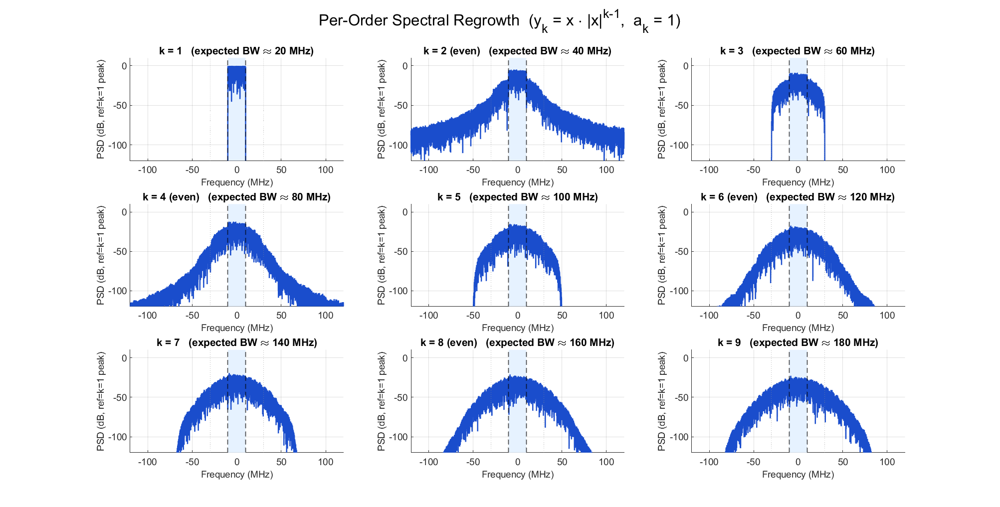

# PA Memoryless Polynomial — Spectral Regrowth Analysis

完整分析 memoryless polynomial PA 模型的 per-order spectral regrowth，並解答一個常見的 PA/DPD 疑問：**「even-order terms 對 ACLR 到底有沒有貢獻？」**

MATLAB simulation + 完整數學推導 + RF vs baseband 雙觀點解釋。

## 摘要

PA 模型：

```math
y = \sum_{k=1}^{K} a_k \cdot x \cdot \lvert x \rvert^{k-1}
```

關鍵發現：

1. **Odd $k$** 的 basis $y_k = x \cdot \lvert x \rvert^{k-1} = x^{(k+1)/2} (x^{\ast})^{(k-1)/2}$ 是 $x, x^{\ast}$ 的**純多項式**，bandwidth **嚴格** $= k \cdot \text{BW}$，超出範圍 exact zero。
2. **Even $k$** 的 basis 含 $\lvert x \rvert = \sqrt{x x^{\ast}}$ 是**非多項式**，spectrum 有 **infinite tail**，洩漏到 ACLR band。
3. **「實體 PA 濾掉 even order」在 RF passband 層次是對的**，但濾掉他的不是晶體管本身，是 PA 輸出端到天線的 bandpass 路徑 (matching network + TX filter + antenna)。
4. Even order **不是沒影響** — 它透過 envelope/bias memory、thermal memory、harmonic reflection 三條間接路徑影響 in-band，這就是為什麼 DPD 要用 memory polynomial / GMP 而不是加 even basis。

完整推導跟數值結果看 [`PA_poly_regrowth_report.md`](./PA_poly_regrowth_report.md)。

## Per-Order Spectral Regrowth (視覺化)



9 個 subplot 對應 $k = 1 \ldots 9$。仔細看 odd 跟 even 的差別：
- **Odd (1, 3, 5, 7, 9)**：梯形 + hard cutoff (polynomial support)
- **Even (2, 4, 6, 8)**：bell shape + long tail (non-polynomial, sqrt factor)

## ACLR Table

| Order $k$ | $P_\text{in}$ (dB) | ACLR1 (dBc) | ACLR2 (dBc) | 預期 BW |
|:---:|:---:|:---:|:---:|:---:|
| 1 | 0.00 | −39.06 | **−∞** | 20 MHz |
| **2** | −6.64 | −13.79 | **−37.48** | 40 MHz |
| 3 | −11.78 | −8.95 | **−∞** | 60 MHz |
| **4** | −15.85 | −6.42 | **−32.62** | 80 MHz |
| 5 | −19.13 | −4.78 | −25.46 | 100 MHz |
| **6** | −21.83 | −3.62 | −21.06 | 120 MHz |
| 7 | −24.11 | −2.76 | −17.90 | 140 MHz |
| **8** | −26.07 | −2.09 | −15.47 | 160 MHz |
| 9 | −27.80 | −1.55 | −13.53 | 180 MHz |

**注意 $k = 1, 3$ 的 ACLR2 是 exact $-\infty$** (polynomial hard cutoff)，而 $k = 2, 4$ 非零 (sqrt tail)。這不是數值誤差，是數學性質不同。

## Signal Setup

- $F_s = 240$ MHz (sampling rate)
- $\text{BW} = 20$ MHz (rectangular baseband spectrum)
- Input signal: bandlimited random (random-phase IFFT of rectangular mask), complex baseband
- PAPR ≈ 9.35 dB (Rayleigh-like amplitude)
- $N = 2^{15} = 32768$ samples
- Coefficients $a_k = 1$ for all orders (專注 shape/position 分析)

## Files

| File | Purpose |
|:---|:---|
| [`PA_poly_regrowth.m`](PA_poly_regrowth.m) | MATLAB script — 產生 signal、算 per-order spectrum、畫圖、算 ACLR table |
| [`PA_poly_regrowth_report.md`](PA_poly_regrowth_report.md) | 完整技術報告 — 數學推導 + RF passband 解釋 + 對 DPD 的 implication |
| `PA_poly_input.png` | Figure 0: input signal verification (spectrum + amplitude distribution) |
| `PA_poly_odd.png` | Figure 1: odd-order overlay ($k = 1, 3, 5, 7, 9$) |
| `PA_poly_all.png` | Figure 2: all-order overlay ($k = 1 \ldots 9$, odd=solid, even=dashed) |
| `PA_poly_grid.png` | Figure 3: 3×3 per-order subplot grid |

## How to Run

MATLAB R2021a 或更新 (應該任何支援 `hann`, `fftshift`, `yline` 的版本都行)：

```matlab
cd path/to/pa-poly-regrowth
PA_poly_regrowth
```

Script 會：
1. 產生 bandlimited random signal
2. 驗證 input spectrum (ripple, OOB rejection)
3. 對 $k = 1 \ldots 9$ 每個 order 算 basis function 跟 spectrum
4. 做 Parseval + bandwidth + alias 自動驗證 (全 PASS)
5. 畫 4 張圖並存成 PNG
6. 印出 ACLR table
7. 印出 even-order 的雙觀點討論

## 延伸閱讀 / Keywords

Memoryless polynomial PA model, spectral regrowth, AM/AM AM/PM, ACLR, digital predistortion (DPD), memory polynomial, Generalized Memory Polynomial (GMP), Volterra series, bias memory effect, thermal memory, harmonic termination, Class-F PA
